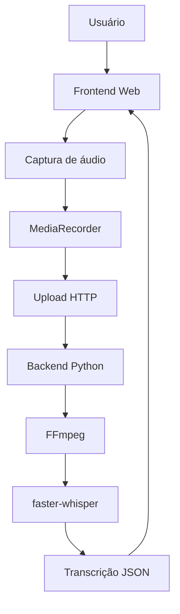

# Audio Transcriber

Aplicação web MVP para capturar áudio diretamente no navegador, enviar o arquivo para um backend em Python, processar o áudio com FFmpeg e gerar transcrições com `faster-whisper`.

O projeto foi desenhado como **web-first**: a captura acontece no navegador e o backend centraliza validação, normalização e transcrição.

## Status

**MVP funcional**

O repositório já entrega um fluxo utilizável para:

- escolher a fonte de captura no navegador;
- gravar áudio de entrada, saída ou ambas as fontes separadamente;
- reproduzir e baixar o áudio capturado;
- enviar o áudio para o backend;
- processar o áudio para WAV 16 kHz mono PCM S16LE;
- transcrever o áudio com `faster-whisper`;
- retornar o resultado em JSON;
- validar entradas e tratar erros comuns;
- executar testes automatizados.

Isso ainda **não** é um produto pronto para produção. Falta persistência, autenticação, histórico, exportações e endurecimento operacional.

## Sobre o projeto

O Audio Transcriber resolve um problema simples: capturar áudio de forma compatível com a web, sem depender de ferramentas locais de captura como `sounddevice`, `PipeWire`, `PulseAudio`, `ALSA` ou `pactl`.

A proposta é permitir que o usuário grave áudio diretamente no navegador, visualize o resultado, envie o arquivo para o backend e receba uma transcrição pronta para uso.

A arquitetura atual divide responsabilidades assim:

- **Frontend**: interface, escolha do modo de captura, gravação com APIs do navegador, reprodução, download, upload e exibição dos resultados.
- **Backend**: API HTTP, validação dos uploads, armazenamento temporário, processamento com FFmpeg e transcrição com `faster-whisper`.
- **FFmpeg**: normaliza o áudio para o formato usado pelo pipeline de transcrição.
- **faster-whisper**: executa a transcrição no backend, usando o modelo `tiny` por padrão em CPU.

Os arquivos recebidos são salvos temporariamente em `backend/temp/uploads/` e os WAV processados em `backend/temp/processed/`. Esses diretórios são criados em runtime e permanecem fora do Git.

A captura no navegador foi escolhida porque o projeto é web-first e precisa funcionar sem depender do ambiente de áudio do computador do usuário. Isso reduz acoplamento com o sistema operacional e mantém o fluxo compatível com diferentes máquinas e navegadores, dentro das limitações das APIs web.

## Funcionalidades

### Captura

- [x] Captura de áudio de saída
- [x] Captura de áudio de entrada
- [x] Captura de entrada + saída
- [x] Gravação através do navegador
- [x] Detecção/tratamento de ausência de áudio
- [x] Tratamento de cancelamento de permissão

### Áudio

- [x] Reprodução da gravação
- [x] Download do áudio
- [x] Upload para o backend
- [x] Validação de formato
- [x] Limite de tamanho

### Processamento

- [x] Processamento com FFmpeg
- [x] Conversão para WAV
- [x] 16 kHz
- [x] Mono
- [x] PCM signed 16-bit little-endian

### Transcrição

- [x] `faster-whisper`
- [x] Transcrição no backend
- [x] Processamento separado das fontes de áudio quando aplicável

### Qualidade

- [x] Testes automatizados
- [x] Tratamento de erros
- [x] Validações de entrada

## Como funciona



Fluxo principal:

1. O usuário escolhe o modo de captura no frontend.
2. O navegador solicita as permissões necessárias e cria um `MediaStream`.
3. O `MediaRecorder` grava a fonte selecionada.
4. O áudio resultante fica em memória no navegador, com reprodução e download locais.
5. Ao enviar, o frontend monta um `multipart/form-data` e chama `POST /api/audio`.
6. O backend salva o arquivo em diretório temporário, valida MIME type e tamanho, processa com FFmpeg e converte para WAV padronizado.
7. O backend transcreve o WAV com `faster-whisper` e retorna o texto em JSON.

No modo **Entrada + saída**, as duas fontes são capturadas e processadas separadamente. Elas não são misturadas antes da transcrição, para preservar a origem de cada áudio.

### Modos de captura

- **OUTPUT**: captura o áudio proveniente da aba, janela ou tela compartilhada pelo navegador.
- **INPUT**: captura o áudio do microfone.
- **BOTH**: captura entrada e saída em fluxos separados, processando cada fonte de forma independente.

O funcionamento depende das permissões e capacidades do navegador e do sistema operacional. O projeto não promete compatibilidade universal para captura de áudio de saída.

### Responsabilidade de cada camada

**Frontend**

- interface;
- seleção do modo de captura;
- gravação no navegador;
- reprodução e download;
- upload do áudio;
- exibição do estado, diagnóstico e transcrição.

**Backend**

- API HTTP;
- validação do multipart;
- armazenamento temporário;
- processamento com FFmpeg;
- transcrição com `faster-whisper`;
- resposta JSON.

**FFmpeg**

- converte o áudio de entrada para o formato padrão do pipeline: WAV, PCM S16LE, 16 kHz, mono.

**faster-whisper**

- carrega o modelo `tiny`;
- executa a transcrição em CPU com `compute_type="int8"` por padrão;
- reutiliza o modelo carregado em memória.

## Tecnologias utilizadas

| Tecnologia | Utilização |
| --- | --- |
| HTML | Estrutura do frontend |
| CSS | Estilização da interface |
| JavaScript | Captura no navegador, reprodução, upload e renderização dos resultados |
| Python | Backend HTTP e lógica de processamento |
| `http.server` | Servidor HTTP simples do backend |
| FFmpeg | Processamento e normalização de áudio |
| `faster-whisper` | Transcrição no backend |
| `unittest` | Testes automatizados |

## Estrutura do projeto

A árvore abaixo mostra os arquivos versionados atualmente. O diretório `backend/temp/` é criado em runtime e está ignorado pelo Git.

```text
audio-transcriber/
├── backend/
│   ├── __init__.py
│   ├── app/
│   │   ├── __init__.py
│   │   ├── __main__.py
│   │   ├── audio_processing.py
│   │   ├── main.py
│   │   └── transcriber.py
│   └── tests/
│       ├── __init__.py
│       ├── test_audio_processing.py
│       └── test_transcriber.py
├── frontend/
│   ├── css/
│   │   └── style.css
│   ├── js/
│   │   └── main.js
│   └── index.html
├── .gitignore
├── README.md
└── requirements.txt
```

## Como executar localmente

### 1. Clonar o repositório

```bash
git clone <URL_DO_REPOSITORIO>
cd audio-transcriber
```

### 2. Criar e ativar o ambiente virtual

```bash
python3 -m venv .venv
source .venv/bin/activate
```

### 3. Instalar as dependências Python

```bash
pip install -r requirements.txt
```

### 4. Verificar o FFmpeg

```bash
ffmpeg -version
```

No Ubuntu/Debian, se necessário:

```bash
sudo apt update
sudo apt install ffmpeg
```

### 5. Iniciar o backend

Execute a partir da raiz do projeto:

```bash
python3 -m backend.app
```

O backend sobe em:

- `http://127.0.0.1:8000`
- health check: `http://127.0.0.1:8000/api/health`

### 6. Iniciar o frontend

Execute a partir da pasta `frontend/`:

```bash
cd frontend
python3 -m http.server 8001
```

A aplicação fica disponível em:

- `http://127.0.0.1:8001/`

## Como executar com Docker

### Pré-requisitos

- Docker
- Docker Compose

### Iniciar os containers

```bash
docker compose up --build
```

Para iniciar em background:

```bash
docker compose up --build -d
```

### Acessar a aplicação

- Frontend: `http://localhost:8001`
- Backend: `http://localhost:8000`
- Health check: `http://localhost:8000/api/health`

### Verificar o ambiente

```bash
docker compose ps
docker compose logs
docker compose logs backend
docker compose logs frontend
```

### Encerrar o ambiente

```bash
docker compose down
```

No ambiente Docker, o frontend é servido por `nginx` em um container separado. O navegador acessa o frontend em `localhost:8001`, e o frontend continua chamando o backend em `http://127.0.0.1:8000` durante o desenvolvimento local, preservando o comportamento atual do projeto.

## API

### `GET /api/health`

Retorna o estado básico do backend.

Exemplo de resposta:

```json
{
  "status": "ok"
}
```

### `POST /api/audio`

Recebe áudio em `multipart/form-data`, processa o arquivo com FFmpeg e transcreve com `faster-whisper`.

#### Cabeçalhos

- `Content-Type: multipart/form-data`
- `Origin: http://127.0.0.1:8001` ou `http://localhost:8001` no desenvolvimento local

#### Campos aceitos

- `source_mode`:
  - `OUTPUT`
  - `INPUT`
  - `BOTH`
- `file`:
  - compatibilidade com o fluxo legado de saída única
- `output_file`:
  - arquivo da saída
- `input_file`:
  - arquivo da entrada

#### Regras por modo

- **OUTPUT**: aceita `file` ou `output_file`
- **INPUT**: exige `input_file`
- **BOTH**: exige `input_file` e `output_file`

#### MIME types aceitos

O backend normaliza parâmetros do `Content-Type` antes de validar. Os tipos base aceitos são:

- `audio/webm`
- `audio/mp4`
- `audio/ogg`

#### Resposta de sucesso

- **OUTPUT** e **INPUT**: retornam um objeto com metadados do upload, do processamento e da transcrição.
- **BOTH**: retornam um objeto com duas chaves, `input` e `output`, cada uma com sua própria transcrição e metadados.

Exemplo resumido para uma fonte única:

```json
{
  "id": "uuid",
  "status": "transcribed",
  "source_mode": "OUTPUT",
  "source": "output",
  "source_label": "Saída",
  "original_file": "uuid-output.webm",
  "processed_file": "uuid-output.wav",
  "contentType": "audio/webm",
  "original_size": 123456,
  "processed_size": 654321,
  "format": "wav",
  "sample_rate": 16000,
  "channels": 1,
  "processed_content_type": "audio/wav",
  "text": "Texto transcrito aqui.",
  "segments": []
}
```

Exemplo resumido para `BOTH`:

```json
{
  "id": "uuid",
  "status": "transcribed",
  "source_mode": "BOTH",
  "input": {
    "text": "Texto da entrada."
  },
  "output": {
    "text": "Texto da saída."
  }
}
```

#### Códigos de erro

- `400` — requisição inválida ou campos ausentes
- `413` — arquivo maior que 50 MB
- `415` — MIME type não suportado
- `500` — erro interno de processamento ou transcrição
- `503` — FFmpeg ou `faster-whisper` indisponíveis no backend

## Como validar e testar

### Verificações de sintaxe

```bash
python3 -m py_compile backend/app/*.py backend/tests/*.py
node --check frontend/js/main.js
```

### Testes automatizados

```bash
python3 -m unittest discover -s backend/tests -p 'test*.py'
```

A suíte atual cobre validações de upload, processamento com FFmpeg, contrato da API e abstração de transcrição com mocks. Na validação local deste repositório, a suíte executou **21 testes** com sucesso. A validação real do navegador deve ser feita manualmente.

### Fluxo manual recomendado

1. Abrir o frontend em `http://127.0.0.1:8001/`.
2. Escolher o modo de captura.
3. Clicar em **Iniciar captura**.
4. Conceder as permissões do navegador.
5. Gravar áudio.
6. Clicar em **Parar captura**.
7. Reproduzir o áudio capturado.
8. Baixar o áudio, se necessário.
9. Clicar em **Enviar para transcrição**.
10. Aguardar o processamento e conferir a transcrição exibida na interface.

## Limitações atuais

- A captura depende das APIs e permissões do navegador.
- A captura de áudio de saída depende do que o navegador e o sistema operacional permitem compartilhar.
- O modo `BOTH` usa duas capturas independentes e preserva a origem, mas ainda não faz diarização de falantes.
- Não há histórico persistente de gravações ou transcrições.
- Não há autenticação nem sistema de usuários.
- Não há exportação TXT ou SRT.
- Não há banco de dados nem deploy de produção.
- O backend depende de FFmpeg e `faster-whisper` disponíveis no ambiente.

## Roadmap futuro

### MVP atual

- captura de entrada, saída e entrada + saída no navegador;
- reprodução e download do áudio;
- upload para o backend;
- normalização com FFmpeg;
- transcrição com `faster-whisper`;
- execução local com `python3 -m http.server` ou com Docker Compose;
- retorno JSON com transcrição e metadados;
- testes automatizados.

### Próximas versões

- seleção e refinamento de idiomas;
- exportação TXT;
- exportação SRT;
- timestamps mais ricos na interface;
- interface mais polida;
- histórico persistente;
- autenticação;
- limites e segurança para produção;
- Docker;
- deploy;
- melhorias de performance;
- identificação e diarização de falantes.

## Decisões arquiteturais

### Por que capturar no navegador?

Porque a aplicação é web-first e precisa reduzir dependências do sistema operacional do usuário. A captura via APIs web mantém o fluxo multiplataforma e evita acoplamento com ferramentas locais de áudio.

### Por que processar no backend?

Porque o backend concentra a validação, a normalização do áudio e a transcrição, deixando o frontend mais simples e sem dependência direta do pipeline de IA.

### Por que manter INPUT e OUTPUT separados?

Para preservar a origem do áudio. Isso prepara o projeto para representar melhor o contexto da conversa nas próximas versões, sem misturar fontes diferentes antes da transcrição.

### Por que usar FFmpeg?

Porque ele normaliza formatos variados de áudio para um WAV consistente, compatível com o pipeline usado pelo `faster-whisper`.

## Demo

Screenshots e demonstrações serão adicionados em uma próxima atualização.

## Licença

Este repositório não inclui arquivo `LICENSE` no momento.
